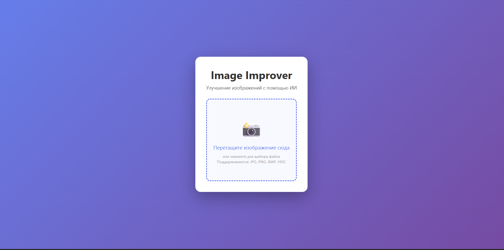
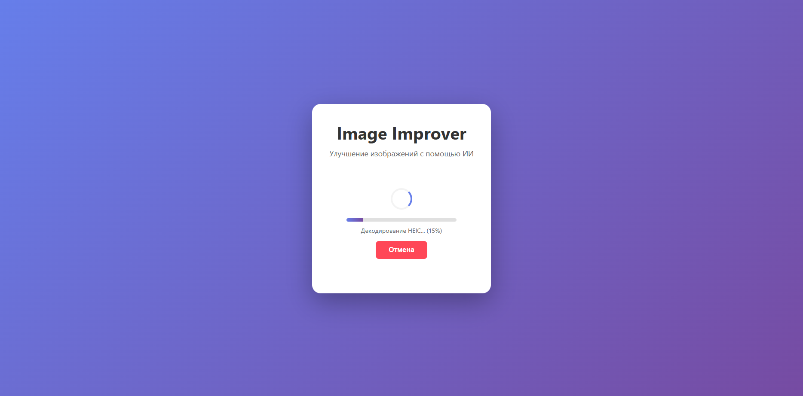
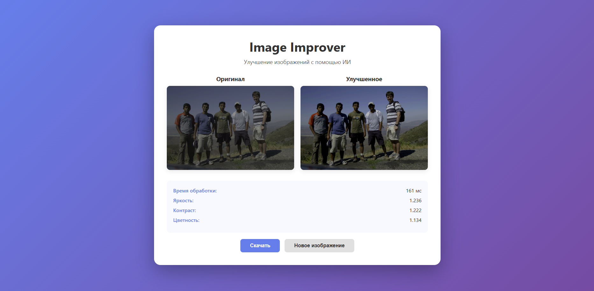

# Image Improver

**Система улучшения изображений в браузере с использованием машинного обучения**



## Описание

Image Improver — это веб-приложение, которое анализирует изображения с помощью ML-модели и автоматически применяет оптимальные параметры коррекции (яркость, контраст, цветность) через WebGL-шейдеры.

Все вычисления выполняются **локально в браузере** — изображения не отправляются на сервер.

### Возможности

- **ML-анализ** — модель предсказывает оптимальные коэффициенты коррекции
- **GPU-ускорение** — применение параметров через WebGL шейдеры
- **Поддержка форматов** — JPG, PNG, BMP, HEIC
- **Приватность** — вся обработка происходит локально
- **Быстрая обработка** — среднее время ~263 мс (6-12 Мп)
- **Прерывание задачи** — возможность отменить обработку
- **Прогресс-бар** — информирование о ходе процесса

## Запуск

### Требования

- Node.js 18+ 
- npm или yarn

### Установка

```bash
# Клонирование репозитория
git clone https://github.com/Roman3115/image-improver.git
cd image-improver

# Установка зависимостей
npm install

# Запуск dev-сервера
npm run dev
```

Откройте браузер и перейдите по адресу: `http://localhost:5173`

### Production-сборка

```bash
npm run build
```

Результат сборки будет в папке `dist/` (размер ~5.81 МБ).

## Демонстрация

### Интерфейс приложения


*Главный экран с зоной загрузки изображений*


*Индикатор прогресса с этапами обработки*


*Сравнение "До" и "После" обработки*

### Пример обработки

| До | После |
|----|-------|
|  |  |

## Документация

- [API Reference](API.md) — описание программного интерфейса
- [Technical Specification](TECH_SPEC.md) — техническая спецификация
- [Performance Metrics](docs/metrics.md) — результаты бенчмарков и профилирования

## Структура проекта

```text
image-improver/
├── datasets/                  # Данные для обучения и валидации ML-модели (JSON)
├── docs/                      # Документация проекта
│   ├── screenshots/           # Скриншоты интерфейса для README
│   ├── API.md                 # Описание программного интерфейса
│   ├── TECH_SPEC.md           # Техническая спецификация
│   └── metrics.md             # Результаты бенчмарков и профилирования
├── public/                    # Статические файлы, доступные по прямому URL
│   ├── benchmark/             # Тестовые изображения для скрипта бенчмарка
│   ├── models/
│   │   └── model.onnx         # Предобученная ML-модель
│   ├── favicon.svg            # Иконка вкладки браузера
│   └── icons.svg              # Векторные иконки интерфейса
├── src/                       # Исходный код приложения
│   ├── api/
│   │   └── ImageEnhancer.ts   # Публичный API библиотеки (главный класс)
│   ├── assets/                # Статические ресурсы UI (логотипы, фоны)
│   ├── core/                  # Ядро системы: ML-инференс и рендеринг
│   │   ├── ml/                # Загрузка модели, предобработка, конфиги
│   │   ├── renderer/          # WebGL-шейдеры и логика отрисовки
│   │   └── Enhancer.ts        # Координатор пайплайна обработки
│   ├── decoders/
│   │   └── HeicDecoder.ts     # Логика декодирования формата HEIC
│   ├── types/
│   │   └── heic2any.d.ts      # TypeScript-декларации для внешних библиотек
│   ├── ui/                    # Компоненты пользовательского интерфейса
│   ├── utils/
│   │   └── imageUtils.ts      # Вспомогательные функции для работы с изображениями
│   ├── workers/
│   │   └── ImageWorker.ts     # Web Worker для фоновых вычислений
│   ├── benchmark.ts           # Скрипт для автоматического замера производительности
│   ├── counter.ts             # Базовый файл шаблона Vite
│   ├── main.ts                # Точка входа в приложение
│   └── style.css              # Глобальные стили
├── .gitignore                 # Исключения для системы контроля версий
├── benchmark.html             # HTML-страница для запуска бенчмарка
├── eslint.config.js           # Конфигурация линтера
├── index.html                 # Главная HTML-страница приложения
├── package-lock.json          # Фиксация точных версий зависимостей
├── package.json               # Зависимости и npm-скрипты
├── tsconfig.json              # Конфигурация компилятора TypeScript
└── vite.config.ts             # Конфигурация сборщика Vite
```